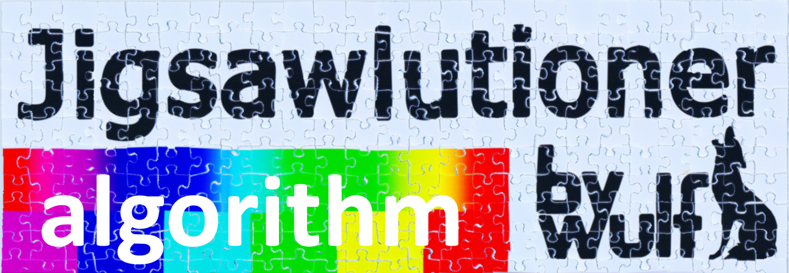
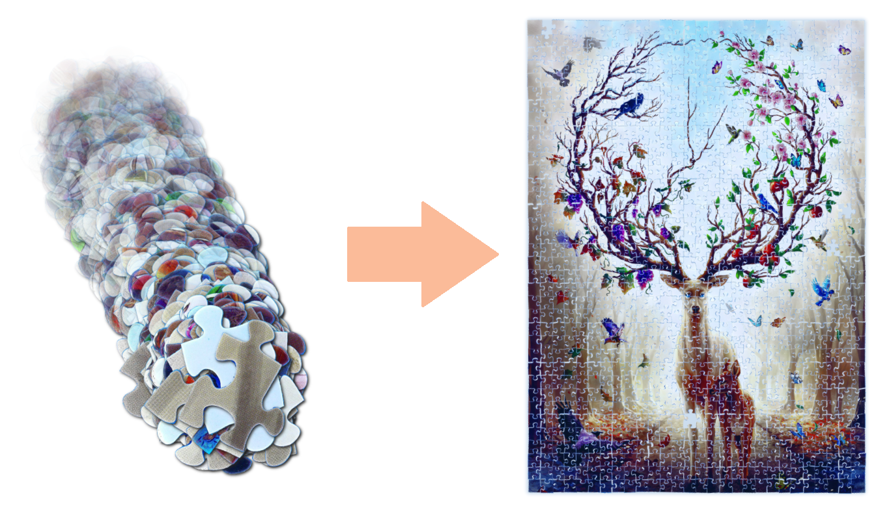

[](https://www.paypal.com/donate/?hosted_button_id=QGSRL3B9BN7BW)
[](https://www.buymeacoffee.com/bywulf)

## About
Jigsawlutioner is an algorithm designed to solve a jigsaw puzzle based on images taken by each puzzle piece.



## See also
* [bywulf/jigsawlutioner-cli](https://github.com/byWulf/jigsawlutioner-cli) - command line tools to use this algorithm
* [byWulf/jigsawlutioner-machine](https://github.com/byWulf/jigsawlutioner-machine) - lego machine scanning and solving the puzzle by its own automatically

## Why
Solving jigsaw puzzles by hand should be a relaxing leisure activity. But when it comes to a point, when you have a table full of black pieces, and all you can do it brutforcing them by trying each side to each other sides resolving in 4 solved connections within 2 hours, that is no fun anymore. This algorithm doesn't care about colors and only looks at the individual formed piece borders so it is able to attack exactly this problem case.

## How it works
It parses the border of a piece image and finds the four corners. Now you have four sides. These sides are then compared to all other sides of all other pieces and ranked by a matching probability. With this information, the solver tries to connect all pieces together as best as they fit. It is forgivable, meaning inperfect borders don't prevent a correct solution, because there can always be some shred from the cutting knifes. We are not in a perfect world with perfect borders, but that's not a problem.

## Solvable jigsaw puzzle manufacturers/forms
Currently only standard rectangle puzzles are supported by the algorithm. Although it is design to be able to solve all kind of rectangle puzzles, only Ravensburger puzzles are currently solved correctly. This is because of the very good and individual forms each side gets by Ravensburger. Other manufacturers use too similar or even identical side forms and therefore this algorithm is not suitable for them.

## Features
1. BorderFinder: Parses an image, extracts the border of the piece and returns an array of points describing the border
2. SideFinder: Analyzes the border points and determines, where each of the 4 corners is. Returns 4 arrays containing the border points of each side.
3. PieceAnalyzer: Normalizes the side points (rotate them horizontal, flatten them and divides them in 100 evently distributed points), generates classifiers of each side (is the nop inside or outside, is the nop more left or right, etc.) and returns a piece object.
4. SideMatcher: Returns the probability between two sides, how good they can fit together.
5. PuzzleSolver: Solves the jigsaw puzzle and returns a matrix of where every piece should be placed with correct rotation.

## Usage
### PieceAnalyzer
You need a high definition image of your puzzle piece. It should be 1000px wide and its borders should be distinct. Best practice: use a backlight when taking the images, so it becomes black/white and the borders really stand out.

If you want to get an image returned where the background got transparent (f.e. to display it somewhere connected to other pieces), specify it also. Best practice: take two images of the piece in the same position. First with backlight for better border detection, and one with normal light for the colored piece becoming transparent. You can request multiple images to become transparent and the size of these image doesn't have to be the same as the original (10 times smaller transparent images are good for displaying the solution to the user instead of the original high definition sized images).
```injectablephp
use Bywulf\Jigsawlutioner\Service\BorderFinder\ByWulfBorderFinder;
use Bywulf\Jigsawlutioner\Service\SideFinder\ByWulfSideFinder;
use Bywulf\Jigsawlutioner\Service\PieceAnalyzer;

$borderFinder = new ByWulfBorderFinder();
$sideFinder = new ByWulfSideFinder();

$pieceAnalyzer = new PieceAnalyzer($borderFinder, $sideFinder);

$image = imagecreatefromjpeg('piece_blackwhite.jpg');
$transparentImage = imagecreatefromjpeg('piece_color.jpg');

$piece = $pieceAnalyzer->getPieceFromImage(1, $image, new ByWulfBorderFinderContext(
    threshold: 0.65,
    transparentImages: [$transparentImage],
));
```

On success a `Piece` object is returned. On failure a `JigsawlutionerException` is thrown.

The most important data in the `$piece` are the `$piece->getBorderPoints()` (which specify the points of the border on the image) and the four `$piece->getSides()` objects. 

Each `Side` object has the following data:
* `$side->getPoints()`: a normalized list of the points of the side. They are reduced to 100 equally distributed and softened points and afterwards rotated horizontally.
* `$side->getStartPoint()`/`$side->getEndPoint()`: The position of the corner points of this side on the image.
* `$side->getClassifiers()`: Each side is described by classifiers. These are simple numbers that are comparable to other sides to see, how much two sides matches. 

We currently have the following classifiers (`SideClassifierInterface`):
* `DirectionClassifier`: contains the information, if the side is straight (on the border of the puzzle) or if has a nop (`DirectionClassifier::NOP_OUTSIDE`) or a hole (`DirectionClassifier::NOP_INSIDE`).
* `BigWidthClassifier`: where is the widest point of the nop/hole and how wide is it
* `SmallWidthClassifier`: where is the smallest point of the nop/hole and how wide is it
* `CornerDistanceClassifier`: how far the the two endpoints of the side apart
* `DepthClassifier`: how deep is the nop/hole
* `LineDistanceClassifier`: we look at the points between the start/end point and the smallest point of the nop/hole. We ignore the first and last 20%. We then look at the remaining points and calculate the minimum, maximum and average distance to the straight line between the two endpoints.

### ByWulfSolver
When you parsed all your pieces, you can start solving the puzzle. First generate a matching map of all probabilities between all sides. Then the solver will search for the solution:
```injectablephp
use Bywulf\Jigsawlutioner\Service\SideMatcher\WeightedMatcher;
use Bywulf\Jigsawlutioner\Service\MatchingMapGenerator;
use Bywulf\Jigsawlutioner\Service\PuzzleSolver\ByWulfSolver;

$sideMatcher = new WeightedMatcher();
$matchingMapGenerator = new MatchingMapGenerator($sideMatcher);
$matchingMap = $matchingMapGenerator->getMatchingMap($pieces);

$solver = new ByWulfSolver();
$solution = $solver->findSolution($pieces, $matchingMap);
```

On success a `Solution` is returned. On failure a `JigsawlutionerException` is thrown.

The solution will contain multiple `$solution->getGroups()`. One for every connected area of the piece. Ideally you get exactly one group containing all pieces.

Each `Group` has a list of `$group->getPlacements()`. One placement for each piece.

Each `Placement` has the following information:
* `$placement->getPiece()`: the piece described in this placement
* `$placement->getX()` / `$placement->getY()`: the position of the piece in the pattern of the group. One unit means one piece row/column. 
* `$placement->getTopSideIndex()`: specifies the side array index of the piece, that points to the top of the group (so the piece must be rotated, that this side is at the top).
